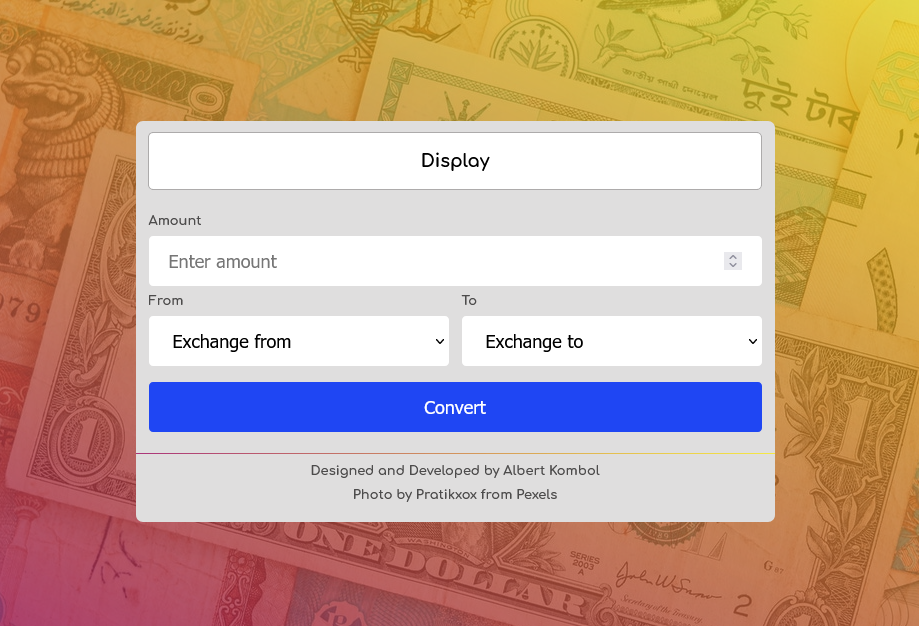

# Simple Currency Converter PWA

## Table of contents

- [Overview](#overview)
  - [The challenge](#the-challenge)
  - [Screenshot](#screenshot)
  - [Links](#links)
- [My process](#my-process)
  - [Built with](#built-with)
  - [What I learned](#what-i-learned)
  - [Useful resources](#useful-resources)
- [Author](#author)


## Overview

### The challenge

Users should be able to:

- View the optimal layout for the component depending on their device's screen size
- Select base and target currencies for convertion
- Convert from base currency to target currency and round up to the nearest whole number
- Transact with their fav currencies while offline
- Install on their device


### Screenshot

#### Desktop view



### Links

- Solution URL: [https://github.com/kalush89/simple-currency-converter](https://github.com/kalush89/simple-currency-converter)
- Live Site URL: [https://simple-currency-converter-chi.vercel.app/](https://simple-currency-converter-chi.vercel.app/)

## My process

### Built with

- Semantic HTML5 markup
- CSS custom properties
- Flexbox
- CSS Grid
- Mobile-first workflow
- IndexedDB

### What I learned

CSS Grid manipulation in Desktop view. I could use grid-area to simplify things but familiarity with this method is the goal for now. 
```css
 main > div#form {
        grid-template: repeat(8, min-content) / 1fr 1fr;
        column-gap: 1em;
    }

    #amount-label {
       grid-column: 1 / span 1;
       grid-row: 1 / span 1;  
    }

    input[type="number"] {
        grid-column: 1 / span 2;
        grid-row: 2 / span 1;
        width: 100%; 
         
     }

     div#err-amount {
        grid-column: 1 / span 1;
        grid-row: 3 / span 1;
     }

     #from-label {
        grid-column: 1 / span 1;
        grid-row: 4 / span 1;  
     }

    select#from {
        grid-column: 1 / span 1;
        grid-row: 5 / span 1;
    }

    div#err-from {
        grid-column: 1 / span 1;
        grid-row: 6 / span 1;
    }

    #to-label {
        grid-column: 2 / span 1;
        grid-row: 4 / span 1;  
     }

    select#to {
        grid-column: 2 / span 1;
        grid-row: 5 / span 1;
    }
    div#err-to {
        grid-column: 2 / span 1;
        grid-row: 6 / span 1;
    }

    input[type="submit"] {
        grid-column: 1 / span 2;
        grid-row: 7 / span 1;
        width: 100%;
       
    }
```
Async await use for API requests return a promise. 
```javascript

    //api request for rate
    getRate = async () => {
        try{
        let currStream = await fetch(`https://free.currconv.com/api/v7/convert?q=${this.encodeUri()}&compact=ultra&apiKey=[apikey]`);
        let rate = await currStream.json();
        return rate;
        }catch(e){
            console.log(e);
        }
    }

    //convert
    convert() {
        this.getRate().then(res => {
            let rate = Object.values(res)[0];
            let display = this.getElement('display');
            let result = rate * this.amount;
            display.innerText = `Exchanges to ${result.toFixed(2)}`;
            
        }).catch(err => console.log(err));
    
        }
}

```

### Useful resources

- [GADS 2021 workshop 'Fetching data from APIs with Javascript'](https://www.youtube.com/watch?v=HPozqIIYyk4) - This gave me a starting point in implementing async/await. I recommend it to anyone starting out.
- [Bitsofcode](https://bitsofco.de/bitsofcode-pwa-part-2-instant-loading-with-indexeddb/) - Thanks to Ire Aderinokun's awsome article I was able to implement IndexedDB with relative ease.
- [Jake Archiebald's IDB library](https://github.com/jakearchibald/idb) - Adds a thin layer to indexeddb that really makes a difference.

## Author

 - [Albert Kombol](https://twitter.com/realterree)

